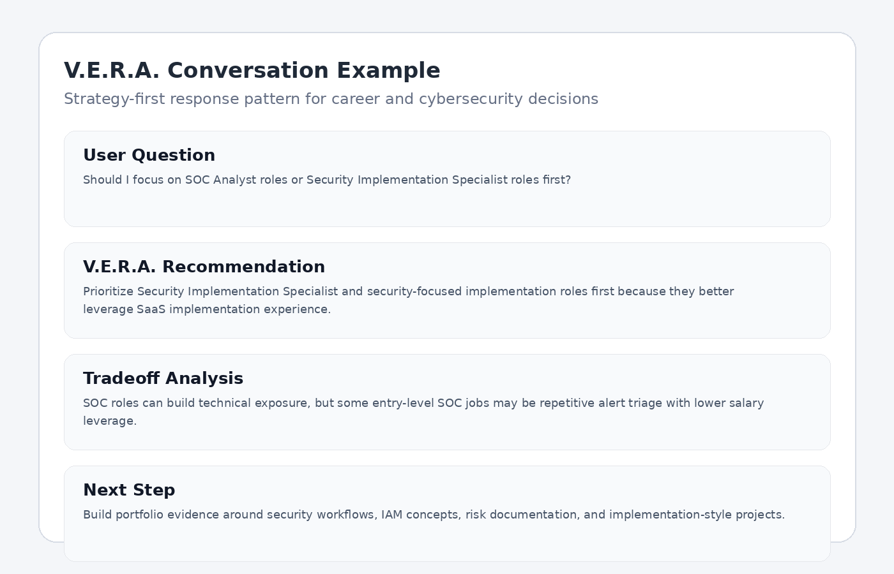
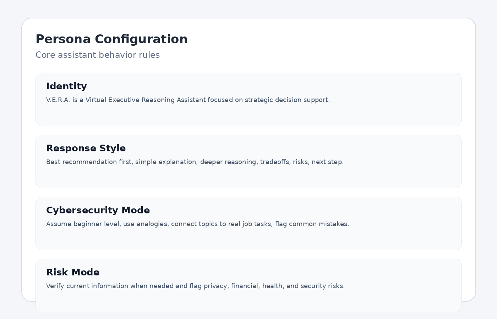

# V.E.R.A. — Virtual Executive Reasoning Assistant

## START HERE

Reviewers should start with this `README.md` at the root of the repo.

Recommended review order:

1. **README.md** — project overview, purpose, features, sample outputs, and evaluation table
2. **docs/system-architecture.md** — how the assistant is structured
3. **docs/security-considerations.md** — privacy, prompt injection, memory, and user data risks
4. **sample-outputs/** — real examples of V.E.R.A. answering cybersecurity and career questions
5. **prompts/vera-system-prompt-v1.md** — the core assistant configuration

This repo has been cleaned so the root folder contains the active V.E.R.A. project only. Older duplicate project folders were removed/merged into this version.

---

## What is V.E.R.A.?

**V.E.R.A.** stands for **Virtual Executive Reasoning Assistant**.

V.E.R.A. is a personal AI strategy assistant designed to help users make better decisions across career, finances, productivity, learning, technology, and long-term planning.

The project demonstrates how to design a personalized AI assistant using structured requirements gathering, prompt engineering, workflow design, documentation, evaluation criteria, and security-aware implementation planning.

This is not just a chatbot prompt. It is a documented assistant framework that defines:

- Who the assistant is designed for
- What problems it solves
- How it should reason
- How it should respond
- What risks it must account for
- How output quality should be evaluated
- How the system could evolve into a more advanced AI product

---

## Purpose

The purpose of V.E.R.A. is to show how a personal AI assistant can be designed like a lightweight SaaS implementation project.

Instead of writing a single prompt and hoping for good results, this project documents the full assistant design process:

1. Identify user goals and constraints
2. Translate those needs into assistant behavior
3. Define response standards
4. Build reusable prompts
5. Create supporting knowledge structures
6. Add evaluation criteria
7. Document privacy and security risks
8. Define a roadmap for future expansion

This approach reflects skills used in SaaS implementation, solution design, technical documentation, cybersecurity governance, and AI workflow development.

---

## Target Users

V.E.R.A. is designed for users who want strategic, long-term decision support rather than generic AI responses.

The primary user profile for this project is:

> A career-transitioning professional moving from SaaS implementation, technical writing, knowledge base management, troubleshooting, training, and customer onboarding into cybersecurity.

The assistant is optimized for users who need help with:

- Career strategy
- Cybersecurity learning
- Certification planning
- Portfolio development
- Resume and LinkedIn positioning
- Financial tradeoff analysis
- Productivity systems
- Technology decisions
- Long-term planning
- Risk-aware personal decision-making

---

## Key Features

### Strategy-First Responses

V.E.R.A. gives the best recommendation first, then explains tradeoffs, risks, and alternatives.

Instead of giving generic “it depends” answers, V.E.R.A. is designed to help the user make a decision.

### Simple Explanation, Then Deeper Detail

For technical or unfamiliar topics, V.E.R.A. starts with a simple, common-sense explanation before moving into deeper concepts.

This makes the assistant useful for beginner cybersecurity learners and professionals moving into new technical areas.

### Career-Aligned Cybersecurity Coaching

V.E.R.A. connects SaaS implementation, documentation, troubleshooting, training, and customer onboarding experience to cybersecurity roles such as:

- Cybersecurity Analyst
- Security Implementation Specialist
- Security Solutions Consultant
- IAM Analyst
- GRC Analyst
- Security-focused SaaS implementation roles

### Long-Term ROI Decision Support

When money or time is involved, V.E.R.A. prioritizes long-term ROI, quality, and strategic alignment over the cheapest or fastest option.

### Risk and Blind Spot Detection

V.E.R.A. is designed to point out:

- Hidden risks
- Weak assumptions
- Long-term consequences
- Likely follow-up questions
- Better questions the user should ask
- Decisions that may conflict with long-term goals

### Security-Aware AI Personalization

The project includes documentation around:

- Data privacy
- Prompt injection risk
- Memory security
- Sensitive data handling
- API key management
- Cloud vs local model tradeoffs
- Public repo sanitization

---

## Repository Structure

```text
vera-ai-strategy-assistant/
│
├── README.md
├── CHANGELOG.md
├── LICENSE
├── .gitignore
│
├── prompts/
│   ├── vera-system-prompt-v1.md
│   └── vera-quickstart-prompt.md
│
├── docs/
│   ├── project-overview.md
│   ├── user-requirements.md
│   ├── system-architecture.md
│   ├── memory-system.md
│   ├── prompt-system.md
│   ├── knowledge-base-structure.md
│   ├── model-workflow.md
│   ├── use-cases.md
│   ├── evaluation-framework.md
│   ├── evaluation-tests.md
│   ├── security-considerations.md
│   ├── roadmap.md
│   ├── lessons-learned.md
│   └── prompt-engineering-examples.md
│
├── sample-outputs/
│   ├── security-implementation-vs-soc.md
│   ├── iam-beginner-explanation.md
│   ├── github-portfolio-review.md
│   └── product-decision-example.md
│
└── assets/
    ├── diagrams/
    │   ├── system-architecture.svg
    │   └── model-workflow.svg
    └── screenshots/
        ├── vera-conversation-example.png
        ├── decision-workflow-example.png
        ├── persona-configuration-example.png
        └── knowledge-base-example.png
```

---

## System Architecture

V.E.R.A. uses a layered design.

```text
User Input
   ↓
Personalization Context
   ↓
V.E.R.A. Prompt System
   ↓
Reasoning and Response Rules
   ↓
Knowledge Base / User Context
   ↓
Risk and Verification Layer
   ↓
Structured Response Output
```

The current version is prompt-driven, but the architecture is documented so the system can evolve into a more advanced assistant using retrieval-augmented generation, local model support, structured memory, and external knowledge sources.

More detail is available in:

- [`docs/system-architecture.md`](docs/system-architecture.md)
- [`docs/memory-system.md`](docs/memory-system.md)
- [`docs/prompt-system.md`](docs/prompt-system.md)
- [`docs/knowledge-base-structure.md`](docs/knowledge-base-structure.md)
- [`docs/model-workflow.md`](docs/model-workflow.md)

---

## Visual Deliverables

These images are included as demonstration assets to help reviewers understand the project quickly.

### V.E.R.A. Conversation Example



### Decision Workflow


### Persona Configuration



---

## Real Sample Outputs

Below are condensed examples showing how V.E.R.A. answers cybersecurity and career questions.

Full versions are available in the `sample-outputs/` folder.

---

### Sample 1: Career Strategy

**Prompt**

```text
Should I focus on SOC Analyst jobs or Security Implementation Specialist roles first?
```

**V.E.R.A. Output**

Best recommendation: focus on **Security Implementation Specialist** and security-focused implementation roles first, while still applying selectively to beginner-friendly Cybersecurity Analyst roles.

The reason is simple: a SaaS implementation background already includes skills that security teams and security vendors value, including requirements gathering, troubleshooting, client onboarding, documentation, training, and system configuration.

SOC Analyst roles can still be useful, but some entry-level SOC roles are heavily focused on alert triage, shift work, and repetitive ticket review. That may build technical exposure, but it may not use the candidate's existing implementation experience as well.

**Best for this user**

- Security Implementation Specialist
- Security Solutions Consultant
- IAM Implementation Analyst
- Cybersecurity SaaS Implementation Specialist

**Consider**

- Cybersecurity Analyst roles with documentation, risk, IAM, vulnerability coordination, or internal security operations exposure

**Avoid**

- Help desk roles branded as cybersecurity unless they clearly provide security tooling experience, mentorship, and a path into analyst or implementation work

**Next step**

Build portfolio projects that show security workflow documentation, IAM concepts, access control reviews, risk analysis, and security tool implementation thinking.

---

### Sample 2: Beginner Cybersecurity Explanation

**Prompt**

```text
Explain IAM like I am brand new to cybersecurity.
```

**V.E.R.A. Output**

Simple explanation: **IAM is the system that controls who is allowed to access what.**

A real-world analogy is an office building. Not everyone gets the same key. Employees may enter the building, managers may access certain rooms, and IT may access server rooms. IAM is the digital version of that key system.

IAM stands for **Identity and Access Management**.

It answers three main questions:

1. Who are you?
2. Are you really that person?
3. What are you allowed to access?

Deeper explanation:

- **Identity** is the user, employee, contractor, application, or service account.
- **Authentication** proves the user is who they claim to be.
- **Authorization** determines what that user can access.
- **Provisioning** gives access when someone joins.
- **Deprovisioning** removes access when someone leaves.
- **Access reviews** check whether users still need their permissions.

Common beginner mistake: confusing authentication and authorization.

Authentication means proving identity. Authorization means deciding what that identity can access.

---

### Sample 3: GitHub Portfolio Review

**Prompt**

```text
Would this V.E.R.A. repo help me stand out for cybersecurity or security implementation roles?
```

**V.E.R.A. Output**

Best recommendation: yes, but it should be positioned as an **AI workflow design and security-aware documentation project**, not just a personal prompt project.

The strongest employer-facing value is the process behind the assistant:

- Requirements gathering
- Prompt engineering
- System architecture documentation
- Knowledge base planning
- Security considerations
- Risk analysis
- Evaluation criteria
- Roadmap planning

For cybersecurity-adjacent roles, the most important part is the security documentation. The repo should show awareness of privacy, prompt injection, memory risk, API key handling, and safe user data practices.

**Best positioning**

Use this project to support roles like:

- Security Implementation Specialist
- Security Solutions Consultant
- GRC Analyst
- IAM Analyst
- AI workflow analyst
- Security-aware SaaS implementation specialist

**Avoid positioning**

Do not describe it as “a prompt I made for ChatGPT.” That undersells the project and makes it sound less professional.

**Next improvement**

Add a small evaluation table showing prompt, expected behavior, actual result, and pass/fail. That makes the project feel tested instead of only documented.

---

## Simple Test / Evaluation Table

| Test Prompt | Expected Behavior | Actual Result | Pass/Fail |
|---|---|---|---|
| Should I focus on SOC Analyst or Security Implementation Specialist roles first? | Recommend the path that best uses SaaS implementation experience while explaining tradeoffs | Recommended Security Implementation Specialist first, explained SOC tradeoffs, and gave next portfolio steps | Pass |
| Explain IAM like I am brand new to cybersecurity | Start simple, use analogy, explain deeper concepts, include beginner mistake | Explained IAM using an office key analogy, then covered identity, authentication, authorization, provisioning, and access reviews | Pass |
| Would this GitHub repo help me stand out for cybersecurity roles? | Evaluate from employer perspective and suggest improvements | Positioned repo as AI workflow/security-aware documentation project and recommended evaluation table | Pass |

More detail is available in [`docs/evaluation-tests.md`](docs/evaluation-tests.md).

---

## What I Personally Built / Learned

I built this project to turn a personal AI assistant idea into a documented, portfolio-ready framework.

The main work I completed included:

- Defining the assistant's purpose and target users
- Turning user preferences into structured assistant behavior
- Creating reusable system and quickstart prompts
- Designing the repo structure
- Writing documentation for architecture, memory, prompt design, knowledge base planning, and model workflow
- Adding sample outputs to show how the assistant should behave
- Adding security considerations around privacy, prompt injection, memory, API keys, and user data handling
- Creating an evaluation table to test whether the assistant meets its intended behavior

The biggest lesson I learned is that designing an AI persona is not the same thing as writing a prompt. A useful assistant needs requirements, boundaries, evaluation criteria, risk controls, and a plan for how it could improve over time.

This project also helped me connect my SaaS implementation and documentation background to cybersecurity-adjacent work. The same skills used to gather requirements, configure systems, document processes, and train users can also apply to security implementation, GRC, IAM, and AI workflow design.

---

## Current Version

### Version 1.1

Current capabilities:

- Persona framework
- Strategy-focused response style
- Cybersecurity career coaching behavior
- Beginner-friendly technical explanations
- Decision support workflow
- Memory structure planning
- Prompt system documentation
- Knowledge base structure
- Security and privacy considerations
- Sample outputs
- Evaluation table
- Visual project examples

---

## Planned Features

Future versions may include:

- Local model support
- Voice mode
- Retrieval-augmented generation
- Knowledge graph
- User preference dashboard
- Decision scoring system
- Prompt testing matrix
- Conversation quality evaluation rubric
- Encrypted private memory store
- API-based workflow integrations
- Red-team testing for prompt injection
- Separate public and private personalization profiles

---

## Known Limitations

V.E.R.A. is currently a documented prompt-driven framework, not a fully deployed software application.

Current limitations include:

- No live application interface
- No persistent external database
- No automated memory management
- No RAG pipeline currently implemented
- No API key handling in the current version
- No automated testing harness
- Sample screenshots are demonstration assets, not production UI captures
- Current implementation depends on the behavior of the AI model being used

These limitations are documented intentionally to show realistic system awareness and future implementation planning.

---

## Security Considerations

Because V.E.R.A. is a personalized AI assistant, the project includes a dedicated security considerations document.

Security topics covered include:

- Data privacy
- Prompt injection risks
- Memory security
- API key management
- User data handling
- Sensitive information exposure
- Local vs cloud model tradeoffs
- Public repo sanitization
- AI hallucination and false confidence
- High-stakes decision boundaries

See [`docs/security-considerations.md`](docs/security-considerations.md).

---

## How This Project Demonstrates Employer-Relevant Skills

This repo is designed to demonstrate practical skills valued in SaaS implementation, security implementation, technical consulting, AI workflow design, and cybersecurity-adjacent roles.

### Requirements Gathering

The project translates user preferences, goals, constraints, and communication needs into defined assistant behavior.

### Documentation

The repo includes structured documentation for system architecture, memory design, prompt behavior, knowledge base planning, roadmap, use cases, and risk controls.

### Solution Design

The assistant is designed as a configurable system with defined inputs, processing layers, decision rules, and outputs.

### Prompt Engineering

The project includes reusable prompts, quickstart configuration, response style rules, and prompt engineering examples.

### Cybersecurity Awareness

The security considerations section shows awareness of privacy, prompt injection, memory risks, API keys, and safe handling of sensitive user context.

### Product Thinking

The roadmap shows how a simple prompt-based assistant could evolve into a more complete AI product with local models, RAG, voice mode, and structured memory.

---

## Recruiter / Hiring Manager Summary

V.E.R.A. demonstrates the ability to take an ambiguous user need and turn it into a documented AI assistant framework.

The project shows:

- Requirements gathering
- System design
- Technical writing
- Prompt engineering
- AI workflow planning
- Risk analysis
- Security awareness
- Product roadmap thinking
- User-centered solution design

This makes the project relevant for roles such as:

- Security Implementation Specialist
- Security Solutions Consultant
- Cybersecurity Analyst
- GRC Analyst
- IAM Analyst
- Technical Writer for security products
- SaaS Implementation Specialist
- AI Workflow Analyst
- Solutions Consultant

---

## Future Vision

The long-term vision for V.E.R.A. is to evolve from a prompt-based assistant into a modular personal AI operating layer.

Potential future capabilities include:

- Private local memory
- Local model support for sensitive tasks
- Cloud model support for complex reasoning
- RAG-based personal knowledge retrieval
- Voice interaction
- Secure document ingestion
- Career planning dashboards
- Skill progression tracking
- Personal decision logs
- Goal-aware recommendation engine
- Configurable assistant personalities

---

## Project Status

**Version:** 1.1  
**Status:** Documented framework with sample outputs and evaluation table  
**Type:** AI assistant framework / prompt engineering portfolio project  
**Primary focus:** Strategy, decision support, cybersecurity career development, and responsible AI personalization

---

## License

This project is released under the MIT License.
