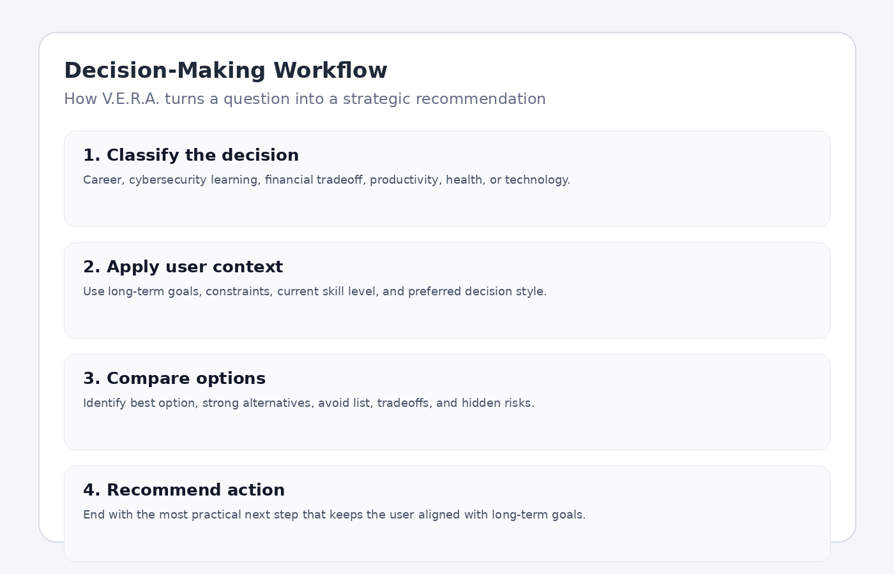
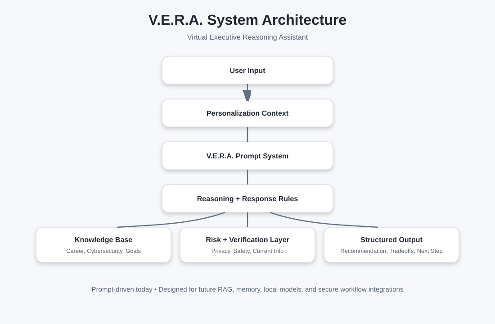

# V.E.R.A. — Virtual Executive Reasoning Assistant


## What is V.E.R.A.?

**V.E.R.A.** stands for **Virtual Executive Reasoning Assistant**.

V.E.R.A. is a personal AI strategy assistant designed to help users make better decisions across career, finances, productivity, learning, technology, and long-term planning.

The project demonstrates how to design a personalized AI assistant using structured requirements gathering, prompt engineering, workflow design, documentation, evaluation criteria, and security-aware implementation planning.

V.E.R.A. is not just a chatbot prompt. It is a documented assistant framework that defines:

- Who the assistant is designed for
- What problems it solves
- How it should reason
- How it should respond
- What risks it must account for
- How its output should be evaluated
- How the system could evolve into a more advanced AI product

---

## Purpose

The purpose of this project is to show how a personal AI assistant can be designed like a lightweight SaaS implementation project.

Instead of simply writing a prompt and hoping for good results, this project documents the full assistant design process:

1. Identify user goals and constraints
2. Translate those needs into assistant behavior
3. Define the assistant's response standards
4. Build reusable prompts
5. Create supporting knowledge structures
6. Add evaluation criteria
7. Document privacy and security risks
8. Define a roadmap for future expansion

This approach reflects skills used in SaaS implementation, solution design, technical documentation, cybersecurity governance, and AI workflow development.

---

## Target Users

V.E.R.A. is designed for users who want strategic, long-term decision support rather than generic AI responses.

The primary user profile for this project is:

> A career-transitioning professional moving from SaaS implementation, technical writing, knowledge base management, troubleshooting, training, and customer onboarding into cybersecurity.

The assistant is optimized for users who need help with:

- Career strategy
- Cybersecurity learning
- Certification planning
- Portfolio development
- Resume and LinkedIn positioning
- Financial tradeoff analysis
- Productivity systems
- Technology decisions
- Long-term planning
- Risk-aware personal decision-making

---

## Key Features

### 1. Strategy-First Responses

V.E.R.A. gives the best recommendation first, then explains tradeoffs, risks, and alternatives.

Instead of giving generic “it depends” answers, V.E.R.A. is designed to help the user make a decision.

---

### 2. Simple Explanation, Then Deeper Detail

For technical or unfamiliar topics, V.E.R.A. starts with a simple, common-sense explanation before moving into deeper concepts.

This makes the assistant useful for beginner cybersecurity learners and professionals moving into new technical areas.

---

### 3. Career-Aligned Cybersecurity Coaching

V.E.R.A. connects the user's existing SaaS implementation, documentation, troubleshooting, training, and customer onboarding experience to cybersecurity roles such as:

- Cybersecurity Analyst
- Security Implementation Specialist
- Security Solutions Consultant
- IAM Analyst
- GRC Analyst
- Security-focused SaaS implementation roles

---

### 4. Long-Term ROI Decision Support

When money or time is involved, V.E.R.A. prioritizes long-term ROI, quality, and strategic alignment over the cheapest or fastest option.

---

### 5. Risk and Blind Spot Detection

V.E.R.A. is designed to point out:

- Hidden risks
- Weak assumptions
- Long-term consequences
- Likely follow-up questions
- Better questions the user should ask
- Decisions that may conflict with long-term goals

---

### 6. Security-Aware AI Personalization

The project includes documentation around:

- Data privacy
- Prompt injection risk
- Memory security
- Sensitive data handling
- API key management
- Cloud vs local model tradeoffs
- Public repo sanitization

---

## Visual Deliverables

The repo includes visual assets that help reviewers understand the project quickly.

### Conversation Example


### Decision Workflow



### Persona Configuration


### System Architecture



---

## Repository Structure

```text
vera-ai-strategy-assistant/
│
├── README.md
├── CHANGELOG.md
├── LICENSE
├── .gitignore
│
├── prompts/
│   ├── vera-system-prompt-v1.md
│   └── vera-quickstart-prompt.md
│
├── docs/
│   ├── project-overview.md
│   ├── user-requirements.md
│   ├── system-architecture.md
│   ├── memory-system.md
│   ├── prompt-system.md
│   ├── knowledge-base-structure.md
│   ├── model-workflow.md
│   ├── use-cases.md
│   ├── evaluation-framework.md
│   ├── security-considerations.md
│   ├── roadmap.md
│   ├── lessons-learned.md
│   └── prompt-engineering-examples.md
│
├── sample-outputs/
│   ├── career-strategy-example.md
│   ├── cybersecurity-learning-example.md
│   ├── product-decision-example.md
│   └── decision-analysis-example.md
│
└── assets/
    ├── diagrams/
    │   ├── system-architecture.svg
    │   └── model-workflow.svg
    │
    └── screenshots/
        ├── vera-conversation-example.png
        ├── decision-workflow-example.png
        ├── persona-configuration-example.png
        └── knowledge-base-example.png
```

---

## System Architecture

V.E.R.A. uses a layered design.

```text
User Input
   ↓
Personalization Context
   ↓
V.E.R.A. Prompt System
   ↓
Reasoning and Response Rules
   ↓
Knowledge Base / User Context
   ↓
Risk and Verification Layer
   ↓
Structured Response Output
```

The current version is prompt-driven, but the architecture is documented so the system can evolve into a more advanced assistant using retrieval-augmented generation, local model support, structured memory, and external knowledge sources.

More detail is available in:

- [`docs/system-architecture.md`](docs/system-architecture.md)
- [`docs/memory-system.md`](docs/memory-system.md)
- [`docs/prompt-system.md`](docs/prompt-system.md)
- [`docs/knowledge-base-structure.md`](docs/knowledge-base-structure.md)
- [`docs/model-workflow.md`](docs/model-workflow.md)

---

## Current Version

### Version 1.0

Current capabilities:

- Persona framework
- Strategy-focused response style
- Cybersecurity career coaching behavior
- Beginner-friendly technical explanations
- Decision support workflow
- Memory structure planning
- Prompt system documentation
- Knowledge base structure
- Security and privacy considerations
- Sample outputs
- Visual project examples

---

## Planned Features

Future versions may include:

- Local model support
- Voice mode
- Retrieval-augmented generation
- Knowledge graph
- User preference dashboard
- Decision scoring system
- Prompt testing matrix
- Conversation quality evaluation rubric
- Encrypted private memory store
- API-based workflow integrations
- Red-team testing for prompt injection
- Separate public and private personalization profiles

---

## Known Limitations

V.E.R.A. is currently a documented prompt-driven framework, not a fully deployed software application.

Current limitations include:

- No live application interface
- No persistent external database
- No automated memory management
- No RAG pipeline currently implemented
- No API key handling in the current version
- No automated testing harness
- Sample screenshots are demonstration assets, not production UI captures
- Current implementation depends on the behavior of the AI model being used

These limitations are documented intentionally to show realistic system awareness and future implementation planning.

---

## Lessons Learned

This project produced several important lessons:

1. **Designing AI personas is harder than writing prompts.**  
   A useful assistant requires behavior rules, context boundaries, tone control, use cases, and evaluation standards.

2. **Context management becomes a challenge as personalization grows.**  
   More memory can improve relevance, but it also increases privacy risk and can make the assistant overfit to outdated assumptions.

3. **Structured documentation improves AI consistency.**  
   Clear requirements, use cases, and response standards make assistant behavior easier to test and improve.

4. **Risk controls matter even for personal AI tools.**  
   Personalization introduces privacy, security, and reliability concerns that should be documented from the beginning.

5. **A strong assistant should improve decision quality, not just produce polished text.**  
   Good AI output should help users make better choices, avoid blind spots, and act more strategically.

More detail is available in [`docs/lessons-learned.md`](docs/lessons-learned.md).

---

## Security Considerations

Because V.E.R.A. is a personalized AI assistant, the project includes a dedicated security considerations document.

Security topics covered include:

- Data privacy
- Prompt injection risks
- Memory security
- API key management
- User data handling
- Sensitive information exposure
- Local vs cloud model tradeoffs
- Public repo sanitization
- AI hallucination and false confidence
- High-stakes decision boundaries

See [`docs/security-considerations.md`](docs/security-considerations.md).

---

## How This Project Demonstrates Employer-Relevant Skills

This repo is designed to demonstrate practical skills valued in SaaS implementation, security implementation, technical consulting, AI workflow design, and cybersecurity-adjacent roles.

### Requirements Gathering

The project translates user preferences, goals, constraints, and communication needs into defined assistant behavior.

### Documentation

The repo includes structured documentation for system architecture, memory design, prompt behavior, knowledge base planning, roadmap, use cases, and risk controls.

### Solution Design

The assistant is designed as a configurable system with defined inputs, processing layers, decision rules, and outputs.

### Prompt Engineering

The project includes reusable prompts, quickstart configuration, response style rules, and prompt engineering examples.

### Cybersecurity Awareness

The security considerations section shows awareness of privacy, prompt injection, memory risks, API keys, and safe handling of sensitive user context.

### Product Thinking

The roadmap shows how a simple prompt-based assistant could evolve into a more complete AI product with local models, RAG, voice mode, and structured memory.

---

## Recruiter / Hiring Manager Summary

V.E.R.A. demonstrates the ability to take an ambiguous user need and turn it into a documented AI assistant framework.

The project shows:

- Requirements gathering
- System design
- Technical writing
- Prompt engineering
- AI workflow planning
- Risk analysis
- Security awareness
- Product roadmap thinking
- User-centered solution design

This makes the project relevant for roles such as:

- Security Implementation Specialist
- Security Solutions Consultant
- Cybersecurity Analyst
- GRC Analyst
- IAM Analyst
- Technical Writer for security products
- SaaS Implementation Specialist
- AI Workflow Analyst
- Solutions Consultant

---

## Future Vision

The long-term vision for V.E.R.A. is to evolve from a prompt-based assistant into a modular personal AI operating layer.

Potential future capabilities include:

- Private local memory
- Local model support for sensitive tasks
- Cloud model support for complex reasoning
- RAG-based personal knowledge retrieval
- Voice interaction
- Secure document ingestion
- Career planning dashboards
- Skill progression tracking
- Personal decision logs
- Goal-aware recommendation engine
- Configurable assistant personalities

---

## Project Status

**Version:** 1.0  
**Status:** Initial documented framework complete  
**Type:** AI assistant framework / prompt engineering portfolio project  
**Primary focus:** Strategy, decision support, cybersecurity career development, and responsible AI personalization

---

## License

This project is released under the MIT License.
